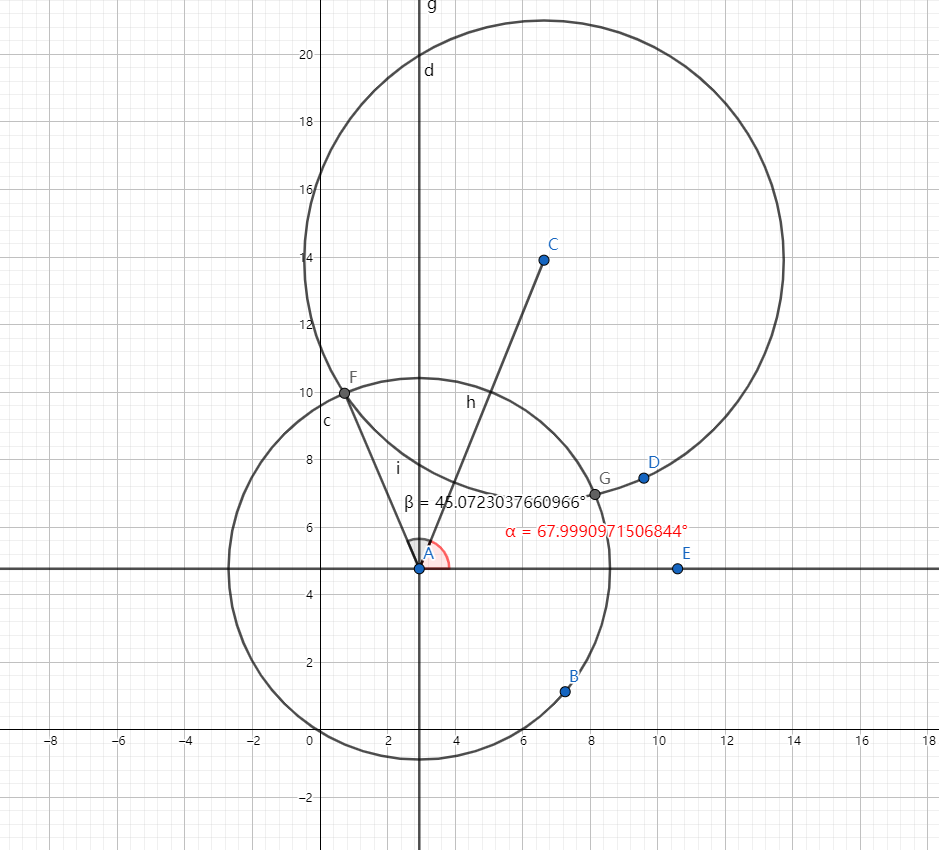

# 20220211省选 总结
### 贪吃蛇
可以发现右旋能走出来的左旋只需要起止点调换也可以走出来，所以不妨假设是右旋。

玩一下样例可以发现走出来的路径一定是两个圈圈，并且一定能够在某处分开。

假如分开两部分看，前一部分是右旋，后半部分从终点往回走到连接处是左旋，所以依据这个$dp$即可。

设$f_{l,r,x,y,0/1/2/3},g_{l,r,x,y,0/1/2/3}$分别表示右旋走法/左旋走法下列为$[l,r]$行为$[x,y]$的矩形，目前在四个角中的某个的最大权。

那么转移有两种，一种是从这个方向上退一格的位置走过来，另一种是这一行/列是新走出来的，即从上一个方向多补一行/一列。

然后枚举接口位置，提前预处理一下即可$O(n^2)$的合并。

$dp$是$O(n^4)$的，所以总复杂度$O(n^4)$。
### 奇特的门
这题很容易想到对于每个圆分别计算内部边界的弧长。

维护弧用类似极角的东西表示删除部分比较方便，即记下所有要删除的极角区间$[l_i,r_i]$，最后排序，简单计算即可。

所以思路就显而易见了。

假设目前要计算的是圆$x$的内部边界的弧长，那么枚举$i$，用余弦定理计算出角度，然后记录下来，比如下面就是记录$[\alpha-\beta,\alpha+\beta]$。

对于边界截掉的部分，可以发现边界可以直接当直线来截。

最后排序计算没有被覆盖的角度，乘上$r$就是弧长。

那么总的时间复杂度就是$O(n^2 \log n)$，$\log n$是因为最后又排序。
### 苹果树
这题要**矩阵树定理**，不会证明，这里把结论放下来。

对于无向图的生成树个数，可以这样计算：

有度数矩阵$D$，$D_{i,i}=deg(i)$，$D_{i,j}=0,i \not = j$

有临界矩阵$A$，定义$e(i,j)$表示点$i$和$j$相连的边数，那么$A_{i,j}=A_{j,i}=e(i,j) i \not = j,A_{i,i}=0$

定义Laplace矩阵（也称Kirchhoff矩阵）$L$，为$L=D-A$。

对于任意的$i$，删去第$i$行和第$i$列后的行列式都相同，同时也是生成树个数。

现在回到原题，记$m$表示好苹果个数，可以发现有$x$个有用苹果、$m-x$个无用苹果、$n-m$个坏苹果的方案数，当$x$相同时是一样的，故可以先预处理出恰好有$x$个有用苹果的方案数$f_x$，然后使用折半搜索计数。

不妨先求出钦定有$x$个有用苹果的方案数，用⚪、⬜、🔺分别表示有用苹果、无用苹果、坏苹果，那么连边方案就是⚪-⚪，⚪-🔺，⬜-⬜，🔺-🔺，跑矩阵树定理即可。

但是这样求出来的显然也有有用苹果数少于$x$个的方案被算入，所以是至多$x$个，那么对于一个小于$x$的数$y$，$f_y$在$f_x$中会被算$\binom{x}{y}$次，所以真正的$f_x$应该是$g_x-\sum_{y<x}\binom{x}{y}f_y$。

最后用折半搜索计数即可，时间复杂度$O(\frac{n}{2}2^{\frac{n}{2}}+n^4)$。
### 巧克力
奇妙种树题。

记$pre_i$表示前一个和$i$的值相同的位置，那么区间$[l,r]$的答案就是$\sum_{i=l}^{r} i-\max\{\max_{l \le j \le i}pre_j,l-1\}$。

可以发现瓶颈在$\sum_{i=l}^{r} \max\{\max_{l \le j \le i}pre_j,l-1\}$处，考虑用线段树维护。

线段树区间上维护两个值，一个是$pre$的区间$max$，另一个是这个区间的的前缀$max$的和中右半区间的答案。

考虑如何维护第二个值，不妨用$calc(l,r,mx)$表示要求$[l,r]$的前缀$max$的和，并且都要与$mx$取$max$的答案，这里记[l,mid]区间的$max$值为$ma$，那么分两种情况讨论：
1. $ma<mx$，那么左区间都是$mx$，右区间为$calc(mid+1,r,mx)$
2. $ma\ge mx$，那么右区间就是之前就维护好的值，左区间为$calc(l,mid,mx)$

不难发现这样维护是$\log^2 n$的。

当要求区间$[ql,qr]$的答案时，在线段树上递归时顺便记录前面的$max$，这个$max$的标记往左时不变，往右时与左区间的$max$取$max$即可，这样看上去是会把$ql$之前的部分也取$max$，但是由于$max$的初值就是$ql-1$，所以并不会有影响，最终查到一个完整区间时，用上面的方法计算答案即可。

对于维护$pre$，只需维护历史版本的数组，历史版本的颜色线段树套权值线段树，前者用于取值，后者用于查找前驱后继，再把上面的这个线段树也可持久化就行了。

总时间复杂度就是$O((n+q)\log^2 n)$。