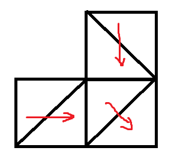

# 20220222省选 总结

### 三明治

比赛的时候没有想出怎么搜索，现在想来真是太蠢了，写了个完全没有正确性的水法，搞了个20pts。

其实已经发现了最关键的性质：若$(x,y)$这个格子是先删左边再删右边，那么$(x,y-1)$也是如此。但是没有想这个性质怎么用。

其实可以推广一下，格子$(x,y)$删除的方向也是逆过去那两个格子删除的方向，这个可以很简单的证明，用图来说明就是如下：

有了上面的性质，假如知道了一个格子删除的方向，就可以逆推为了删除这个格子而要删除的格子的删除方向，就可以dfs出所有要删的格子。

再观察一下，就可以知道对于一行的格子，如果$(x,y)$是从左往右删，那么要先删$(x,y-1)$并且方向也是从左往右，以此类推，左边的都是如此（这个就是上面的性质的应用），所以为了删除$(x,y)$而要删除的格子的集合肯定包含为了删除$(x,y-1)$而删除的格子的集合，那么根据这个dfs就是$O(n^3)$的，从右往左也是类似，这样就求出答案了。

### 呵呵

看到生成树计数，第一思路是矩阵树定理，但是发现$\prod_{i=1}^{n}d_i$这个权无法放进去计数，所以换一个思路，根据$\prod_{i=1}^{n}d_i$这个形式容易想到prufer序列。

根据prufer序列的各种性质，可以知道当各点的度数为$d_i$时，生成树有$\frac{(n-2)!}{\prod_{i=1}^{n}(d_i-1)!}$种，但是这个是没有重边的，这题点与点之间选的边不同是有区别的，这看起来似乎比较难计算，但是仔细观察可知：若$i,j$在选则方案中练了边，那么要乘上$w_iw_j$，发现各部分之间都是用乘法连接，所以可以交换顺序和合并，最后可以发现$w_i$会计算$d_i$次，所以一个合法的度数序列对应的生成树个数与权一并的计数为$\prod_{i=1}^{n}d_i\prod_{i=1}^{n}w_i^{d_i}\frac{(n-2)!}{\prod_{i=1}^{n}(d_i-1)!}$。这个可以把与$d_i$有关的合在一起算，那么就可以$O(n^3)$的dp出来。

考虑把它优化成$O(n^2)$的dp。
$$
\begin{aligned}
&\sum_{\sum_{i=1}^{n}d_i=2n-2,\forall 1\le i \le n,d_i\ge 1} \prod_{i=1}^{n}d_iw_i^{d_i}\frac{(n-2)!}{\prod_{i=1}^{n}(d_i-1)!} \\
& (n-2)!\prod_{i=1}^{n}w_i \sum_{\sum_{i=1}^{n}d_i=n-2,\forall 1\le i \le n,d_i\ge 0}\prod_{i=1}^{n}\frac{(d_i+1)w_i^{d_i}}{d_i!}
\end{aligned}
$$
这一步是把$d_i$先减一，使其取得范围是非负数，这个范围更大更全较易化简，还有就是把无关的项提出去，减少计算量。

下面关于不写的$d$的限制就是同上，然后把$(d_i+1)$这种东西拆开，对于各个单项式分别算。
$$
\begin{aligned}
& \sum_{d}\prod_{i=1}^{n}\frac{(d_i+1)w_i^{d_i}}{d_i!}\\
& \sum_{d} \sum_{1\le p_1 <p_2<\dots<p_k\le n,0\le k \le n}\prod_{i=1}^{k}d_{p_i}\prod_{i=1}^{n}\frac{w_i^{d_i}}{d_i!}\\
& \sum_{1\le p_1 <p_2<\dots<p_k\le n,0\le k \le n}\sum_{\sum d=n-2-k} \prod_{i=1}^{k}w_{p_i}\prod_{i=1}^{n}\frac{w_i^{d_i}}{d_i!}
\end{aligned}
$$
这个就是把$p$和$d$交换求和顺序，并且把提出来的$d_{p_i}$和分母上的阶乘抵消，但是为了好看还是把$d_{p_i}$减一，同时把少算的$w_{p_i}$提出来。

下面是把$\prod w$给提到外面，因为和$d$无关，剩下的部分看着比较像指数生成函数。

不妨把后面的$\sum_{\small \sum d=n-2-k}\prod_{i=1}^{n}\frac{w_i^{d_i}}{d_i!}$用生成函数来推，对于每个$i$，其生成函数就是$F_i(x)=\sum_{j\ge 0}\frac{w_i^jx^j}{j!}=e^{w_ix}$，那么前面的和式就是$[x^{n-2-k}]\prod_{i=1}^{n}F_i(x)$，也就是要求$[x^{n-2-k}]e^{(\small \sum w)x}$，展开就是$\frac{(\sum w)^{n-2-k}}{(n-2-k)}!$，所以最后答案就是如下式子：
$$
\sum_{k\ge 0}\sum_{p}\Big(\prod w_{p_i}\frac{(\sum w)^{n-2-k}}{(n-2-k)}\Big)
$$
这个就可以$O(n^2)$的dp了。

### 回转寿司

考场上想用线段树上的暴力骗分，没想到数据这么强。

从部分分入手，可以发现对于$\forall i,s_i=1,t_i=n$的情况每次被换出来的数就是现在的最大值。

正解是分块，如果一个块从来都没有被当作散块来查询，那么其实块内的数到底在什么位置是不重要的，只需要用上面的做法即可维护，但是现实显然不能这么美好，所以要考虑当被当散块来处理时应该怎样重构。

把每次的查询的$p$挂在这个区间上作为$tag$，那么当要重构时，把这些$p$放入小根堆中，从前往后扫这个区间，那么显然第一个位置会尝试和这些$p$中的最小值做交换，如果可以就把最小的$p$放在第一个位置上，把第一个位置上的数放入堆中，这个正确性比较好证明。

那么分析复杂度，假设分的块长度为$B$，那么查询的复杂度就是$O(q\frac{n}{B}\log \frac{n}{B})$，散块重构的复杂度是$O(qB\log q)$，当$B=\sqrt n$时时可以的，但由于$n,q$有一些不同且各部分的常数不一样，所以把块长调大似乎会快一些？

